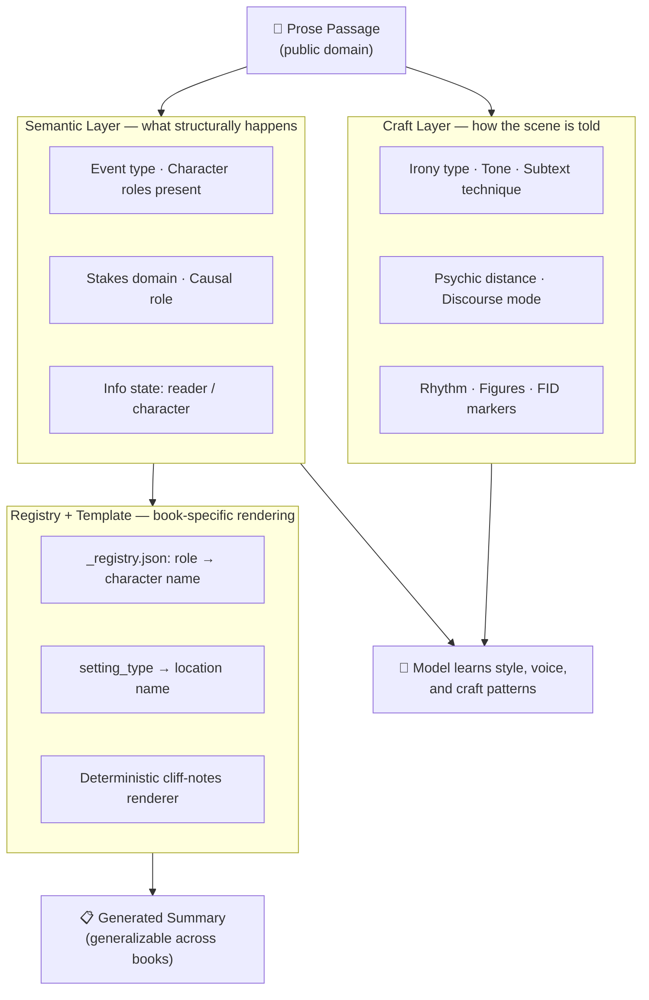
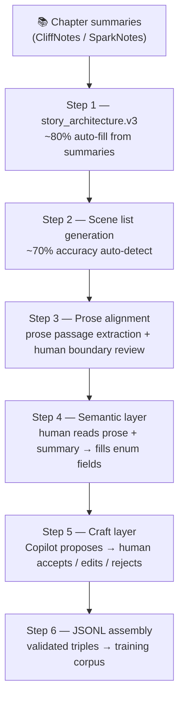
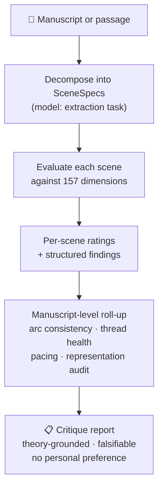
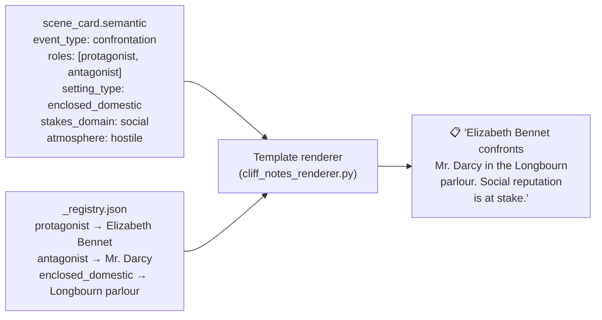
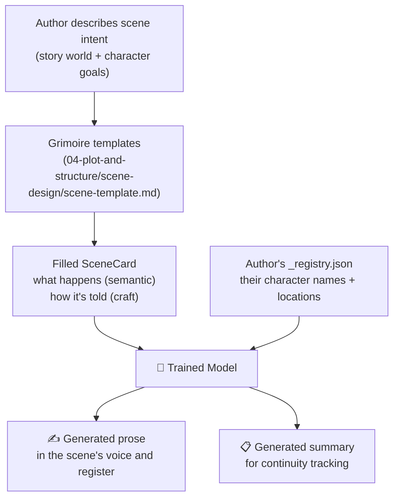

# Training Pipeline and AI Capabilities

This document describes how the CAP Narrative Profile protocol enables AI training for narrative fiction — what the model learns, how training data is structured, and what capabilities emerge.

> **IP boundary:** Training exclusively on public-domain texts means no modern author's work is incorporated into model weights. The structural annotation layer — the vocabulary of `SceneCard`, `CharacterSceneState`, and `ProseFeatures` fields — is derived from literary theory, not copied from any source text. This creates a principled boundary between learning from the tradition of literature and appropriating contemporary creative work.

---

## How the Structure Enables AI Learning

The scene is the natural unit of narrative learning. A model trained on scenes rather than arbitrary text windows learns the causal and emotional logic of storytelling — not just surface-level style. Because scenes are fully self-contained (character states at entry and exit; explicit knowledge transfers; tracked threads), training examples require no external lookup.

```mermaid
flowchart LR
    subgraph Theory["📚 Literary Theory (100+ scholars)"]
        T1[Genette · Booth · Herman]
        T2[Searle · Lotman · Bakhtin]
        T3[Mulvey · Kristeva · Ahmed]
    end

    subgraph Ontology["🗂 CAP Narrative Profile Ontology<br/>157 enum vocabularies"]
        G1[genre_type · collision_pattern]
        G2[emotion · wound_category · arc_direction]
        G3[speech_act · spatial_semantics]
    end

    subgraph PD["📖 Public Domain Novels"]
        P1[Pride & Prejudice]
        P2[The Great Gatsby]
        P3[Frankenstein · Jane Eyre · ...]
    end

    subgraph Corpus["🏷 Annotated Scene Corpus"]
        C1[SceneSpec + Prose pairs]
        C2[Extraction examples]
        C3[Continuity validation]
    end

    subgraph Model["🤖 Trained Model"]
        M1[Generate prose from spec]
        M2[Decompose prose into spec]
        M3[Critique with theory grounding]
    end

    Theory --> Ontology
    Ontology --> Corpus
    PD --> Corpus
    Corpus --> Model
```



---

## Training Task Types

The model is trained on paired examples in both directions:

| Task | Input | Output |
|------|-------|--------|
| **A — Generate** | SceneSpec (YAML) | Prose passage |
| **B — Extract** | Prose passage | SceneSpec (YAML) |
| **C — Track state** | Character state (entry) + Prose | Character state (exit) |
| **D — Validate** | SceneCard + prior scene summaries | Valid \| Invalid + explanation |

Because every spec field uses a finite, theory-grounded enum vocabulary, the
model learns *structural patterns* — not book-specific identifiers. "When an
`antagonist` makes a `directive` speech act toward a `protagonist` with
`power_balance: other_char_has_power`, tension typically increases regardless of
whether the antagonist is Darcy, Tom Buchanan, or Heathcliff."

---

## The Three Annotation Layers



The separation between the **craft layer** (learned) and the **registry**
(deterministic per-book lookup) is what enables a model trained on public-domain
works to generate summaries and prose for entirely new books: functional roles
(`protagonist`, `antagonist`, `love_interest`) generalize; character names do not.

---

## Training Pipeline (6 Steps)



**Estimated effort per novel (Tier 1 — public-domain with CliffNotes):** ~10–20
hours total human annotation thanks to automated scaffolding and Copilot-assisted
field proposals.

---

## What a Trained Model Can Do

A model trained on the CAP Narrative Profile scene corpus can:

1. **Translate summaries into prose** — Given a scene specification (arc,
   character states, setting, stakes), generate a prose passage that enacts those
   structural facts with appropriate craft choices (voice, register, rhythm,
   subtext technique).

2. **Decompose existing prose** — Extract a fully structured `SceneSpec` from
   any prose passage, labelling the scene's craft and semantic dimensions in
   theory-grounded vocabulary.

3. **Critique and rate with expert grounding** — Evaluate any prose passage or
   manuscript against 157 theory-grounded dimensions. Every finding is tied to a
   named framework and a specific field value — not personal taste. See the full
   critique capability breakdown below.

4. **Enable non-expert authorship** — Authors can describe their story world,
   characters, and individual scene intentions without prose-craft expertise. The
   model bridges the gap between *knowing the story* and *writing the scene*.

5. **Protect modern intellectual property** — Because training data is limited
   to public-domain works and the annotation vocabulary is derived from
   literary theory, no modern author's voice or original expression is captured
   in model weights.

---

## Critique and Rating Capability

This is a primary use case. A model trained on CAP Narrative Profile can read any prose passage and
produce structured, theory-grounded critique — at scene level, chapter level, or
whole-manuscript level — in a way that no general-purpose language model can
match.

### Why Standard LLM Critique Falls Short

General LLMs critique by pattern-matching against training data: they reproduce
the stylistic preferences of critics whose writing they absorbed. The result is
criticism that sounds authoritative but is grounded in nothing citable —
**preference disguised as analysis**.

CAP Narrative Profile critique is different in three ways:

| | General LLM | CAP Narrative Profile model |
|---|---|---|
| **Grounding** | Absorbed preferences | Named theorist + enum field |
| **Repeatability** | Varies by phrasing | Same schema → same dimensions evaluated |
| **Falsifiability** | Not testable | Every claim maps to a passage + field value |
| **Coverage** | Inconsistent | 157 dimensions evaluated systematically |
| **Bias** | Hidden | Explicitly modelled (audit schema flags it) |

### What Gets Evaluated

Every critique operates across five dimension groups:

```
Scene-Level Craft
 ├─ Dramatic turn         — does the scene move between two opposed polarities?
 ├─ Subtext               — is there a Gricean violation, Pinter pause, iceberg category?
 ├─ Psychic distance      — is Gardner's 5-level scale used with intention?
 ├─ Speech acts           — what illocutionary forces are operating in dialogue?
 └─ Figures & rhythm      — Jakobson poetic function, Leech/Short foregrounding

Character Craft
 ├─ Want/need alignment   — Truby: are character's conscious want and unconscious need opposed?
 ├─ Wound activation      — is the declared wound_category triggered in this scene?
 ├─ Arc direction         — is the character's arc_direction consistent with their exits?
 └─ Objective coherence   — does the character's tactic match their stated objective?

Narrative Architecture
 ├─ Event significance    — Chatman kernel vs. satellite: does this scene earn its place?
 ├─ Narrative time        — Genette order/duration/frequency: is analepsis purposeful?
 ├─ Thread management     — are open threads escalating, resolving, or stalling?
 └─ Reader experience     — Sternberg: is this scene generating curiosity, suspense, or surprise?

Prose Quality
 ├─ Agency ratio          — Halliday transitivity: who acts vs. who is acted upon grammatically?
 ├─ Defamiliarization     — Shklovsky: is perception refreshed or automatized?
 ├─ Metaphor quality      — Max Black dead/active/resonant: is figurative language alive?
 └─ Sentence architecture — variety across grammatical_sentence_type and clause_position

Critical Theory Audits
 ├─ Representation        — gaze_type (Mulvey), postcolonial_mode (Said/Spivak)
 ├─ Feminist reading      — feminist_narrative_type (Lanser/DuPlessis)
 ├─ Intersectional        — matrix_of_domination (Collins/Crenshaw)
 └─ Ethics                — narrative_ethics_mode (Booth/Keen/Nussbaum)
```

### Critique Output Format

Because every dimension maps to a schema field, critique output is structured and
comparable across works:

```yaml
scene_critique:
  scene: "Ch. 34 — Darcy's proposal"

  strengths:
    - dimension: dramatic_turn
      finding: "turn from hope → humiliation is fully enacted across both characters"
      theory: "scene_polarity enum; McKee story values"
    - dimension: speech_act
      finding: "Darcy's proposal operates as a directive + declaration simultaneously,
                creating irreconcilable felicity conditions — the scene's core tension"
      theory: "Searle illocutionary_force: directive + declaration"

  weaknesses:
    - dimension: want_need_alignment
      field_value: "false_want"
      finding: "Darcy's stated want (marriage) conflicts with his expressed contempt —
                the scene would benefit from a moment where that contradiction costs him"
      theory: "Truby want_need_alignment"
      severity: moderate

  ratings:
    dramatic_turn:        9/10   # strong polarity movement
    subtext_depth:        8/10   # Gricean violations sustained throughout
    character_coherence:  7/10   # want/need tension present but underplayed
    prose_agency:         8/10   # protagonist grammatical agency rises at scene close
    overall:              8/10
```

### Scene-Level vs. Manuscript-Level Rating



Manuscript-level critique aggregates scene ratings to surface:

- **Pacing problems** — sequences of satellite scenes with no kernel; or kernels
  with insufficient setup
- **Arc drift** — `arc_direction` inconsistencies across a character's scenes
- **Thread neglect** — threads introduced but never escalated or resolved
- **Representation patterns** — `gaze_type` or `postcolonial_mode` flags
  concentrated in specific character types
- **Voice inconsistency** — `narrative_voice_register` or `psychic_distance`
  shifting without craft justification

### The Critique Is Falsifiable

Every finding can be challenged by pointing at the text. If the model says
`want_need_alignment: false_want` for a character, the author can dispute it by
showing that the want and need are in fact aligned — which would also be a
finding, just a different one. This grounds literary discussion in the text
itself, not in the authority of the critic.

---

## Semantic Layer and Registry

The semantic layer is what makes the system **generalize across books**. It sits
between the craft layer (which teaches the model *how* a scene is told) and the
final rendered text (which is always book-specific). Without it, the model can
describe style but cannot generate a meaningful scene summary or prose passage
for a new work.

### The Problem: Roles, Not Names

Character names cannot generalize. A model trained on "Darcy" learns only about
Darcy. A model trained on `antagonist` learns about the structural role of
opposition — and that learning transfers to every novel.

```
❌ "Darcy arrives at Netherfield" — book-specific, unlearnable
✅ event_type: arrival + character_roles_present: [antagonist] + setting_type: enclosed_domestic
   → with registry → "Darcy arrives at Netherfield"
   → with different registry → "Heathcliff arrives at Wuthering Heights"
   → with different registry → "Tom Buchanan arrives at Gatsby's party"
```

The functional role vocabulary (`protagonist`, `antagonist`, `love_interest`,
`mentor`, `foil`, `confidant`, `catalyst`, `narrator`, and 10 more) generalizes
across every novel in the literary tradition.

### Semantic Layer Fields

Filled by human annotators reading prose + chapter summary side-by-side:

```yaml
semantic:
  event_type:               # arrival | confrontation | revelation | concealment |
                            # discovery | introspection | decision | refusal | ceremony | ...
  character_roles_present:  # [narrator_pov, protagonist, antagonist, love_interest, ...]
  setting_type:             # enclosed_domestic | threshold | open_exterior |
                            # public_social | institutional | natural_wilderness | ...
  setting_atmosphere:       # hostile | neutral | welcoming | uncanny |
                            # oppressive | sublime | claustrophobic | liminal
  stakes_domain:            # social | romantic | physical | psychological |
                            # moral | material | existential | political
  info_state_reader:        # new | confirmed | contradicted | ironized | none
  info_state_character:     # new | confirmed | contradicted | deceived | none
  causal_role:              # setup | consequence | both | standalone
```

Every value is a finite enum — no free text — ensuring all training examples use
identical vocabulary regardless of which annotator filled the field.

### Registry Format

Each book requires a `_registry.json` that maps functional role names to the
book-specific character names and location names used by the cliff-notes
renderer. The registry is **never used during training** — only at inference time
to render output for a specific book.

```json
{
  "characters": {
    "narrator_pov":    "Elizabeth Bennet",
    "protagonist":     "Elizabeth Bennet",
    "antagonist":      "Mr. Darcy",
    "love_interest":   "Mr. Darcy",
    "authority":       "Lady Catherine de Bourgh",
    "ally":            "Jane Bennet",
    "confidant":       "Charlotte Lucas"
  },
  "settings": {
    "enclosed_domestic":  "Longbourn parlour",
    "threshold":          "Netherfield entrance hall",
    "public_social":      "Meryton assembly rooms",
    "open_exterior":      "Pemberley grounds"
  }
}
```

A second book's registry uses identical keys, different values:

```json
{
  "characters": {
    "narrator_pov":   "Nick Carraway",
    "protagonist":    "Jay Gatsby",
    "antagonist":     "Tom Buchanan",
    "love_interest":  "Daisy Buchanan"
  },
  "settings": {
    "enclosed_domestic": "Gatsby's mansion",
    "threshold":         "Gatsby's front door",
    "public_social":     "Gatsby's party lawn"
  }
}
```

### Rendering Pipeline

The cliff-notes renderer is fully deterministic — it requires no model inference.
Given a semantic spec and a registry, it composes a human-readable scene summary
by substituting roles for names and assembling a template phrase:



The same semantic spec with a different registry produces:

> *"Nick Carraway confronts Tom Buchanan in Gatsby's mansion. Social reputation is at stake."*

This is why the semantic layer is learnable and the registry is not: the model
generalizes the structural pattern; a human author provides the book-specific
mapping for their own novel.

### How Template and Semantic Work Together



A new author never writes into a void. They fill structured scene templates — describing *what* happens structurally — and supply a registry that names their characters and places. The model handles the *writing*.
